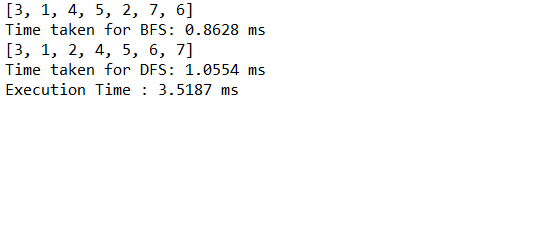

# Graph Traversal using BFS and DFS

This is a small learning project on how to traverse a graph using BFS and DFS. The application also logs the time taken by both the methodologies.

## Learning

### BFS  :  https://en.wikipedia.org/wiki/Breadth-first_search

### DFS  :  https://en.wikipedia.org/wiki/Depth-first_search

## Prerequisites

1. Java (https://www.java.com/en/download/)

## Installing

**Clone the project *GraphTraverse* to your workspace.**

Pass in the necessary VM arguments to execute the graph search.

*The graphs should have V vertices  and N is the starting vertice (the vertice to start traversal)
 
 
1 <=a <= 2,147,483,647  
2 <=b <= 2,147,483,647
 
N >=1 
V >=1  *

The VM arguments are passed as below
  
V 
N 
a b 
. 
. 
. 
 

Compile and run the project 

## Authors

**Sarath Pillai** 

Connect @ https://www.linkedin.com/in/sarath-pillai-21bb85137/
